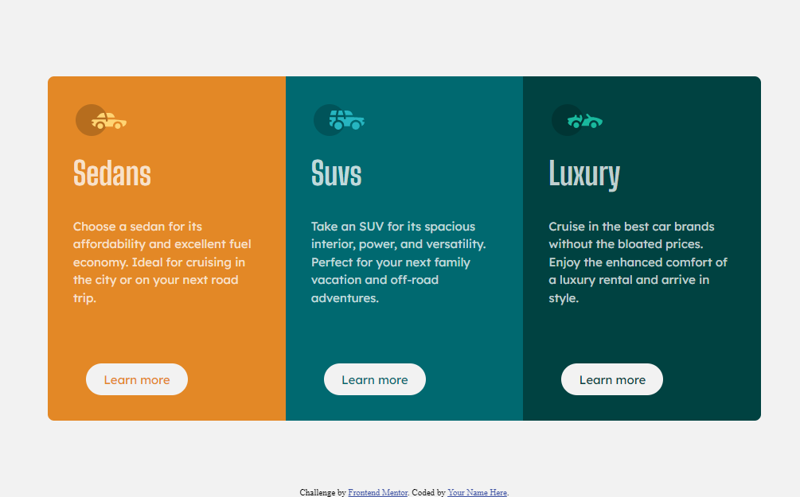
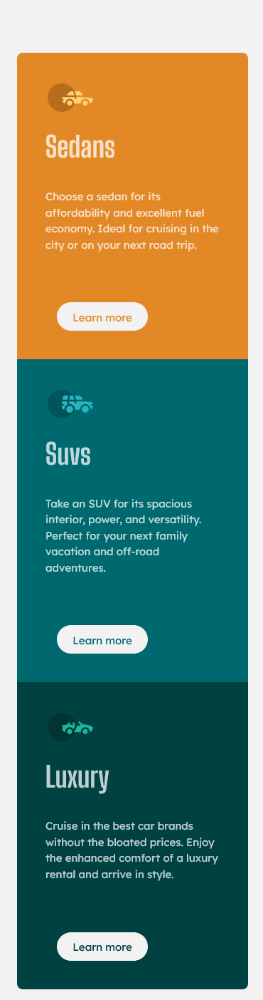

# Frontend Mentor - 3-column preview card component solution

This is a solution to the [3-column preview card component challenge on Frontend Mentor](https://www.frontendmentor.io/challenges/3column-preview-card-component-pH92eAR2-). Frontend Mentor challenges help you improve your coding skills by building realistic projects. 

## Table of contents

- [Overview](#overview)
  - [The challenge](#the-challenge)
  - [Screenshot](#screenshot)
  - [Links](#links)
- [My process](#my-process)
  - [Built with](#built-with)
  - [What I learned](#what-i-learned)
  - [Continued development](#continued-development)
  - [Useful resources](#useful-resources)
- [Author](#author)
- [Acknowledgments](#acknowledgments)

**Note: Delete this note and update the table of contents based on what sections you keep.**

## Overview

### The challenge

Users should be able to:

- View the optimal layout depending on their device's screen size
- See hover states for interactive elements

### Screenshot

<!--  -->

### Links

- Solution URL: [Solution](https://github.com/scottskinn/Frontend-mentor/tree/main/3-column-preview-card-component-main)
- Live Site URL: [Live](https://scottskinn.github.io/Frontend-mentor/3-column-preview-card-component-main/)

## My process

### Built with

- Semantic HTML5 markup
- CSS custom properties
- Flexbox
- CSS Grid

### Continued development

I plan to keep working on my flexbox skills!

### Useful resources

- [Guide to Flexbox](https://css-tricks.com/snippets/css/a-guide-to-flexbox/#aa-flexbox-tricks) - Im sure many people have visted this site and I got lots of help from it!

## Author

- Website - [Scott Skinn](https://scott-skinn.netlify.app/)
- Frontend Mentor - [@scottskinn](https://www.frontendmentor.io/profile/scottskinn)
